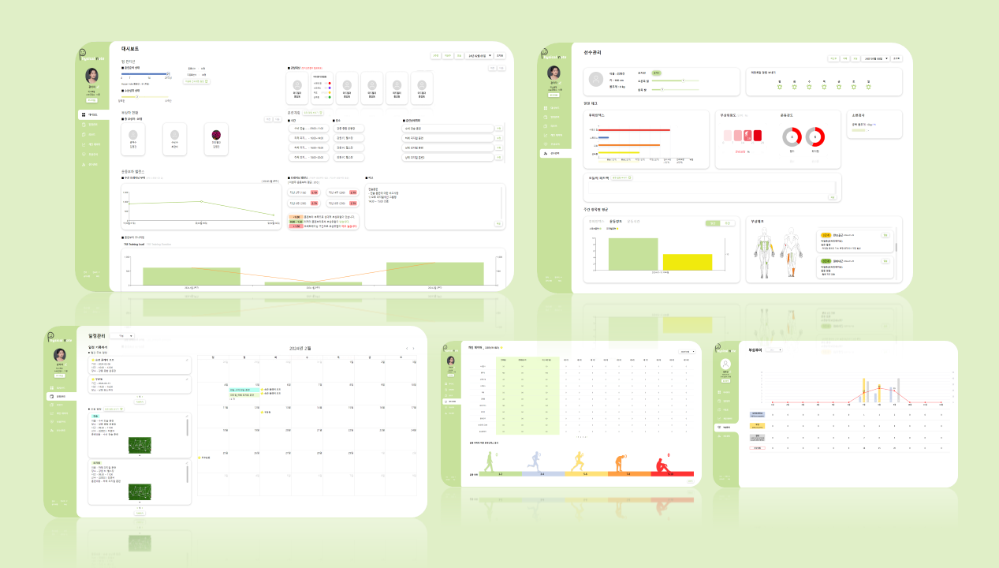

# physical-note

⚛ PHYSICAL-NOTE WEB (피지컬 노트) : 스마트 선수 관리 서비스

 

## 서비스 설명

선수의 일정, 컨디션, 운동부하, 부상 및 통증, 신체 데이터를 스마트하게 관리할 수 있는 선수 관리 웹사이트

- v1.0
  - 인증 권한 : 로그인, 비밀번호 변경, 내정보 조회
  - 대시보드
  - 일정 관리 : 캘린더 조회, 일정 등록/수정
  - 리포트 : 일간/주간 조회
  - 개인 데이터 : 선수 리스트, 상세
  - 선수 관리
- v1.1
  - 운동강도 등록 알림
- v1.2
  - 대시보드 : 운동부하 밸런스 UI 개선
  - 일정관리 : 카테고리 고정 및 MD(매치데이)추가
  - 선수관리 : 주간 항목 UI 개선
  - 리포트 : UI 개선 및 추가

 

## Frontend

### ✨ 기술 설명

Next.js, TypeScript 를 이용해 Front-end 개발

### 🔥 기술 스택

> 사용 SPA 라이브러리 : Nextjs

| **항목** | **기술 스택**     |
| -------- | ----------------- |
| 환경세팅 | Next CNA          |
| 사용언어 | TypeScript        |
| 스타일링 | CSS, Tailwind CSS |
| 상태관리 | Recoil, SWR       |
| 코드통합 | Prettier          |
| 에러검출 | Eslint            |
| API 통신 | Axios             |

### ✔ 추가 라이브러리 & 버전 정보

| **항목**     | **버전 정보**          |
| ------------ | ---------------------- |
| Node         | v18.19.1 (>= v18.17.0) |
| React        | v18                    |
| Next         | v14.0.1                |
| Recoil       | v0.7.7                 |
| Axios        | v1.6.0                 |
| Tailwind CSS | v3.3.0                 |

 

---

🔗 [PHYSICAL-NOTE(피지컬노트)](https://coach.physicalnote.com/login)
